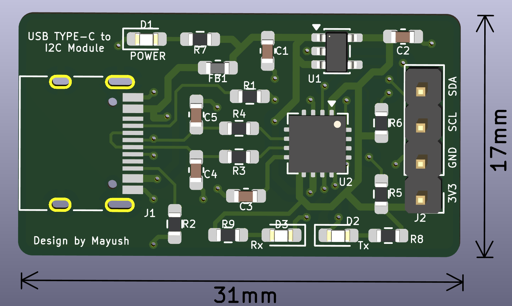

# USB Type-C to I2C Bridge Module using FT201X IC

 

## Overview
A highly compact, production-ready USB Type-C to I2C hardware bridge. This module is designed to interface high-speed USB data from a host PC directly with external I2C peripherals, displays, and sensors. 

Engineered with a strict focus on Design for Manufacturability (DFM) and Design for Assembly (DFA), the board packs power regulation, signal filtering, and data conversion into a 31x17mm footprint using high-density 0603 surface-mount components.

## Hardware Architecture
* **Core Bridge IC:** FTDI FT201X (Full-Speed USB to I2C Bridge).
* **Power Regulation:** Integrated 3.3V Low Dropout (LDO) regulator to provide clean, low-noise power to both the internal logic and external I2C header.
* **EMI Suppression:** Custom RC low-pass filter network (27Ω / 47pF) on the USB D+ and D- data lines for impedance matching and high-frequency noise mitigation.
* **Bus Stability:** Dedicated 2.2kΩ hardware pull-up resistors on the SDA and SCL lines to guarantee sharp signal edge-rates at Fast Mode (400 kHz) clock speeds.
* **Host Isolation:** Ferrite bead input filtering on the 5V VBUS to block high-frequency switching noise from the host PC.

## Diagnostic Interface
The module features a custom diagnostic LED array utilizing the configurable CBUS pins of the FT201X to provide immediate visual feedback of bus states:
* 🔴 **RED:** Power indicator (Tapped downstream of the input filter).
* 🔵 **BLUE:** RX Data Activity.
* 🟢 **GREEN:** TX Data Activity.

## Board Specifications
| Feature | Specification |
| :--- | :--- |
| **Dimensions** | 31mm x 17mm |
| **Layers** | 2-Layer FR4 (Solid bottom ground plane) |
| **Component Size** | 0603 Imperial (Passives & LEDs) |
| **Trace Width** | 0.254mm (10 mil) standard |
| **Input Interface** | USB Type-C (Receptacle) |
| **Output Interface** | 4-Pin 2.54mm Header (3V3, GND, SCL, SDA) |

## Repository Structure
* `/Hardware` - Source KiCad 7/8 project files (Schematic and PCB layout).
* `/Fabrication` - Manufacturing package (Gerbers, Excellon Drill files, and CSV BOM).
* `/Docs` - PDF schematics, 3D renders, and component datasheets.

## Assembly Notes
This board was intentionally designed to be hand-solderable despite its small size. All passive components use the `_HandSoldering` 0603 footprint variants to provide extended pad surface area for tweezer and iron assembly. Ensure the FT201X internal CBUS pins are configured via the FT_Prog utility to activate the TX and RX LED indicators after assembly.

## Author
**Designed by MAYUSH RAHANGDALE**

## License
This project is licensed under the MIT License - see the LICENSE file for details.
